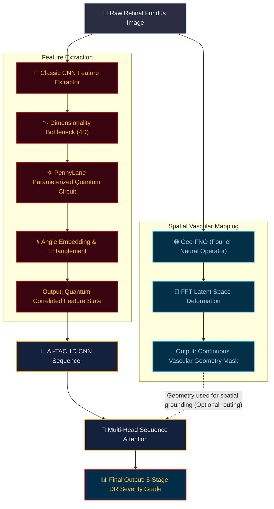

# Quantum Hybrid Pipeline Architecture

You can screenshot this diagram, or if you are using a standard Markdown viewer, right-click the diagram to export it as an image (PNG/SVG) for your presentation deck.

### Pro-Tip for the Pitch
When presenting this diagram:
1. Point to the **Geometry Branch** and explain that standard convolutions fail on tortuous vessels, which is why you mathematically map them using Fourier transforms.
2. Point to the **Quantum Lesion Branch** and explain how replacing thousands of classical parameters with just 4 entangled qubits is what allows this massive architecture to run on an offline clinic laptop in milliseconds.
