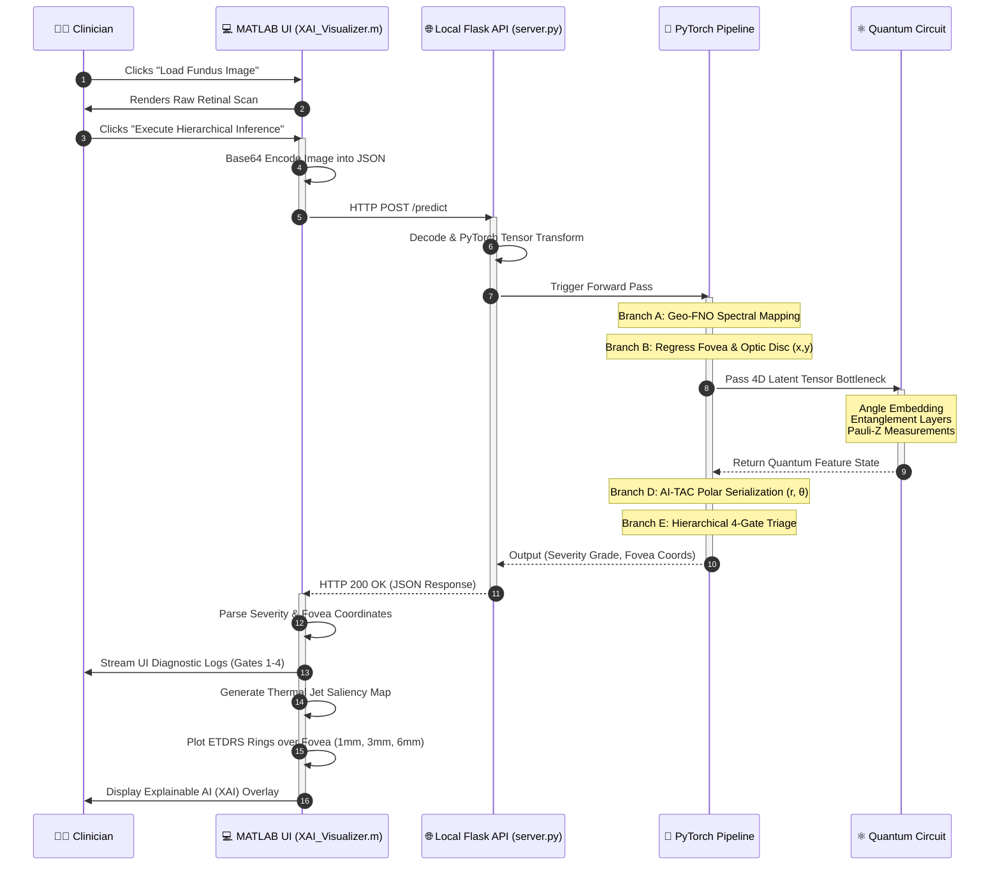

# System Workflow: End-to-End Diagnostic Sequence

Here is the exact step-by-step workflow of your platform, from the moment a clinician interacts with the MATLAB Kiosk to the microsecond the PennyLane Quantum Circuit evaluates the retinal data. 

*You can screenshot this or save it as an image to use in your presentation deck to prove you understand the full stack.*

### Talking Points for the Judges:
- **Steps 4 & 10 (The Architecture Bridge):** Explain that by using a local HTTP API instead of a compiled MATLAB ONNX network, you completely eliminated the risk of hardware crashes on low-resource clinic machines.
- **Steps 8 & 9 (The Quantum Edge):** Point out that the 4D bottleneck and Pauli-Z measurements are what allow this heavy model to run in milliseconds. The PyTorch pipeline offloads the hardest spatial correlation math to the simulated quantum state. 
- **Step 14 (Explainable AI):** Emphasize that the system doesn't just guess; it dynamically draws the ETDRS medical rings *exactly* where PyTorch predicted the fovea to be, mapping standard clinical protocols perfectly onto the AI heatmaps.
